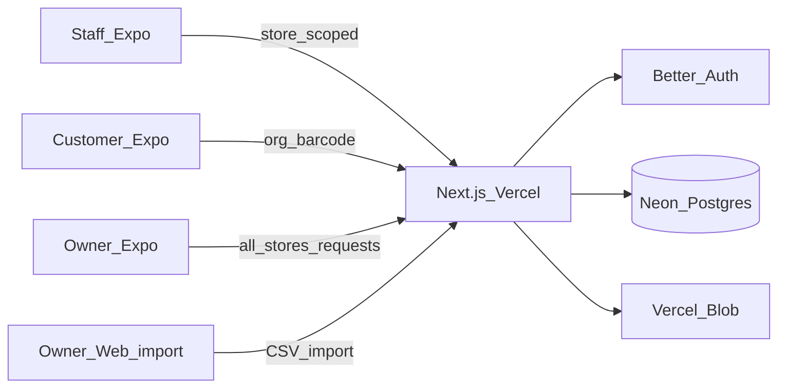

# Off-licence multi-store app (Expo + Vercel)

## Decisions locked in
- **Audience:** Staff + customers in one Expo app (role-based UI)
- **Stores:** Multi-store (one organisation owns many locations)
- **Customer v1:** Browse only — scan/search barcode, see which stores have stock and price
- **Customer access:** **Invite-only** (owner/manager invites customers). Not open signup — all-store stock + price is commercially sensitive.
- **Staff:** Logged-in staff are **bound to one store** — they only see that store's stock
- **Staff actions:** Report **stock count** (stocktake) and **request new stock** (scan product → request qty)
- **Unknown barcode:** Staff **cannot** invent catalogue products. On unknown scan they can **flag for owner** (`product_suggestion` / “unknown barcode” queue). Owner/manager reviews and adds the product. Managers may also add products for their org.
- **Owner fulfilment:** No supplier/cash-and-carry integrations yet — owner sees all store requests, buys offline, then **marks done** with **quantity bought**
- **Request rules:** At most **one open** `stock_request` per `(storeId, productId)`. Partial fulfil allowed (`quantityBought` may differ from `quantityRequested`). Inventory always bumps by `quantityBought`. Cancel: creator (staff) or owner/manager.
- **Grouping:** Requests and catalogue organised by **product category** (fixed enum) + **source place** (org-managed list, e.g. Booker / Bestway / local cash & carry)
- **Catalogue input:** Owner can **bulk-upload** a catalogue file when they have one, **or add products one by one**. No live wholesaler API in MVP.
- **Upload surface:** **CSV/spreadsheet import on web** (`apps/api` owner page) — large wholesaler files are awkward on phone. **One-by-one add on mobile** (scan + form).
- **Images:** Optional product image via **Vercel Blob**. Owner/manager can add/replace/remove on one-by-one product create/edit (mobile + web). CSV import does **not** require images; optional `imageUrl` column only if already hosted (no bulk binary upload in MVP).
- **Stack:** Expo + Next.js API on Vercel + Neon Postgres + Better Auth
- **No payments / online orders** in MVP

## Architecture



**Repo layout (Turborepo):**
- [`apps/mobile`](apps/mobile) — Expo Router
- [`apps/api`](apps/api) — Next.js App Router API + **owner web pages** (catalogue import)
- [`packages/db`](packages/db) — Drizzle schema + migrations
- [`packages/shared`](packages/shared) — Zod types / API contracts

## Data model

- **organisation** — the off-licence business
- **store** — location (`name`, address, opening hours)
- **user** + Better Auth tables
- **membership** — `userId`, `organisationId`, `role` (`owner` | `manager` | `staff` | `customer`)
  - **staff:** exactly one `storeId` (required)
  - **manager:** one or more stores via **`membership_store`** (`membershipId`, `storeId`) — not a single optional `storeId`
  - **owner / customer:** no store binding (`storeId` null; customer sees all stores’ availability)
- **source_place** — org-managed list (`organisationId`, `name`, optional `sortOrder`) used for grouping / shopping lists
- **product** — org catalogue: `barcode`, name, brand, **`category`** (enum: `beer` | `wine` | `spirits` | `soft_drinks` | `tobacco` | `snacks` | `other`), **`sourcePlaceId`** (FK to `source_place`), size, ABV, optional **`imageUrl`** (Vercel Blob public URL)
- **inventory** — per store: `storeId`, `productId`, `quantity` (nullable until first count), `sellPricePence`, `reorderLevel`
- **stock_count** — stocktake log: `storeId`, `productId`, `countedByUserId`, `quantityCounted`, `previousQuantity` (null if never set), `createdAt`
- **stock_request** — restock request from staff:
  - `storeId`, `productId`, `requestedByUserId`
  - `quantityRequested`, `note` optional
  - `status`: `open` | `done` | `cancelled`
  - `fulfilledByUserId`, `quantityBought`, `fulfilledAt`
  - Unique partial index: one **open** row per `(storeId, productId)`
- **product_suggestion** — staff-flagged unknown barcode: `organisationId`, `storeId`, `barcode`, `suggestedByUserId`, `note` optional, `status` (`open` | `accepted` | `dismissed`), `createdAt`
- *(Optional later)* **supplier** table / live wholesaler links — MVP stays on `source_place` + offline fulfil

Barcode uniqueness: `(organisationId, barcode)`.

## Role rules

| Role | Stock visibility | Actions |
|------|------------------|---------|
| **staff** | **Only their assigned store** | Scan → view product; report stock count; create/update open stock request; flag unknown barcode; cancel **own** open requests |
| **manager** | Their assigned store(s) | Same as staff + edit sell price / reorder level; add/edit products; invite staff/customers for their stores; cancel requests for their stores |
| **owner** | All stores in org | Everything manager can do across all stores; **request board**; mark requests done + enter qty bought; **catalogue** (web CSV import + mobile one-by-one); manage `source_place` list; invite users; review product suggestions |
| **customer** | All stores (availability) — **invite-only** | Barcode finder across stores only |

Staff APIs always filter to `membership.storeId`. Manager APIs filter to `membership_store` rows. Never return other stores’ quantities to staff.

## Core flows

```mermaid
sequenceDiagram
  participant Staff
  participant API
  participant Owner
  participant DB
  Staff->>API: Scan barcode at their store
  alt known product
    API->>DB: Product + inventory for that store only
    Staff->>API: Submit stock_count or stock_request
    API->>DB: Insert count / upsert open request
  else unknown barcode
    Staff->>API: Flag product_suggestion
    API->>DB: Insert suggestion open
    Owner->>API: Accept suggestion / add product
  end
  Owner->>API: List open requests grouped by sourcePlace then category
  Owner->>API: Mark done with quantityBought
  API->>DB: status=done; inventory.quantity += quantityBought
```

**Staff — stock count (single SKU)**
1. Login → locked to their store (managers with multiple stores get a store picker)
2. Scan barcode:
   - **Known + inventory row:** show name, category, source place, current qty (or “No qty yet — enter counted”)
   - **Known, no inventory row yet:** treat qty as unset; first successful count **creates** inventory and sets quantity
   - **Unknown:** offer **Flag for owner** (optional note) — do not invent a product
3. Enter counted qty → saves `stock_count` and **sets** `inventory.quantity` to counted value
4. **Confirm** when `|counted − previous|` is large (e.g. previous was set and delta ≥ max(5, 25% of previous)) or when previous was unset and counted is high — reduces accidental overwrites. Counts are always **per SKU**, not an implied full-shop stocktake session in MVP.

**Staff — request stock**
1. Scan (or pick from **low-stock list**: `quantity IS NOT NULL AND quantity <= reorderLevel`) → enter qty needed + optional note
2. If an **open** request already exists for that `(storeId, productId)`, **update** `quantityRequested` / note instead of creating a second open row
3. Staff can see **their store's** open/done/cancelled requests; they may cancel their own open requests

**Owner — fulfil (cash & carry)**
1. **Requests** screen: group list by **`sourcePlace`**, then by **`category`**
2. Each line: store name, product, qty requested, who asked
3. After buying offline: mark **Done**, enter **quantity bought** (may be less, equal, or more than requested)
4. System sets request `done` and **increments that store's inventory** by `quantityBought` (if inventory row missing, create it with that qty). No external PO/API.

**Owner — catalogue (upload or one-by-one)**
1. Two surfaces:
   - **Web import** (`apps/api` owner page) — upload CSV against a **documented template** (no fancy column-mapping UI in MVP). Upsert on `(organisationId, barcode)`. Return summary: created / updated / skipped / row errors.
   - **Mobile Add product** — scan or type barcode; name / brand / category / source place / size / ABV; optional **photo** (camera/library → upload to Vercel Blob → store `imageUrl`); save one at a time
2. Default import creates **products only**. Optional columns (`storeName`/`storeId`, `quantity`, `sellPricePence`, `reorderLevel`) may seed inventory when present. Optional `imageUrl` if URLs already exist; no zip/multipart image bulk in MVP.
3. After product-only import, inventory qty stays **unset** until first stock count or fulfil — UI must say so.
4. Replacing an image uploads a new Blob object and updates `imageUrl`; old Blob should be deleted when replaced/removed (best-effort).
5. Open Food Facts prefill on single-add: **deferred** (post-MVP nicety).

**Owner — product suggestions**
1. List open suggestions (barcode, store, who flagged, note)
2. **Accept** → jump to Add product with barcode prefilled → mark suggestion `accepted`
3. **Dismiss** → `dismissed`

**Customer (invite-only)**
1. Must have `customer` membership for the org
2. Scan → product + stores with stock > 0 (price + address)
3. No requests / counts / suggestions

## Auth & API (key routes)

- Better Auth on Next.js; Expo session via SecureStore; invite links create membership with role
- `GET /api/products/by-barcode` — customer: all stores; staff/manager: scoped stores; includes “unset qty” vs numeric qty
- `GET /api/stores/:storeId/inventory` — staff/manager: only if store in scope; supports `?lowStock=1`
- `POST /api/stock-counts` — staff+ for own store; server applies overwrite + returns whether confirm threshold was suggested (client confirms with `confirmLargeDelta: true`)
- `POST /api/stock-requests` — staff+ upserts single **open** request for `(storeId, productId)`
- `POST /api/stock-requests/:id/cancel` — creator or manager/owner
- `GET /api/stock-requests?status=open` — owner: all stores, grouped by `sourcePlace` → `category`; manager: their stores
- `POST /api/stock-requests/:id/fulfil` — owner: `{ quantityBought }` → mark done + bump inventory
- `POST /api/products` / `PATCH /api/products/:id` — owner/manager product create/update (category enum + `sourcePlaceId` + optional `imageUrl`)
- `POST /api/products/:id/image` — owner/manager; client uploads via **Vercel Blob client token** (or server stub upload); returns `{ imageUrl }` and persists on product
- `DELETE /api/products/:id/image` — owner/manager; clear `imageUrl` + delete Blob
- `POST /api/products/import` — owner; multipart CSV on **web**; template columns only
- `GET|POST /api/source-places` — owner manage list
- `POST /api/product-suggestions` — staff flag unknown barcode
- `GET /api/product-suggestions` + accept/dismiss — owner/manager
- Expected import columns (minimum): `barcode`, `name`; recommended: `brand`, `category`, `sourcePlace` (name matched/created), `size`, `abv`; optional: `imageUrl`; optional inventory: `storeId`/`storeName`, `quantity`, `sellPricePence`, `reorderLevel`

## Mobile UX (Expo)

**Staff tabs:** Scan | Inventory (my store) | Requests (my store) | More  
**Owner tabs:** Scan (org) | Requests (fulfil board) | Stores | Products | More  
**Customer tabs:** Scan | Stores  

**Products (owner/manager, mobile):** primary action **Add product** (incl. optional image); secondary link/copy explaining **Import on web** (URL to `apps/api` import page). Product detail/edit can change or remove image. List sectioned by category; empty state: add as you scan, or import CSV on web if you have a wholesaler/EPOS export. Thumbnail in scan/inventory rows when `imageUrl` present.

**Scan unknown:** clear empty state + **Flag for owner** CTA.

Inventory / request lists: section headers by **category**; owner fulfil board primary sort by **source place**.

## Infra

- Neon Postgres via Vercel Marketplace
- **Vercel Blob** for product images (`@vercel/blob`; client uploads with short-lived tokens from the API)
- Env: `DATABASE_URL`, `BETTER_AUTH_SECRET`, `EXPO_PUBLIC_API_URL`, `BLOB_READ_WRITE_TOKEN`
- EAS Build later for TestFlight / Play

## Implementation order

1. Monorepo scaffold (Turborepo + Expo + Next.js + Drizzle + Better Auth + Vercel Blob)
2. Schema + migrations (`membership` + `membership_store`, `source_place`, category enum, `product.imageUrl`, nullable inventory qty, `stock_count`, `stock_request` unique open, `product_suggestion`)
3. Auth + store-scoped authorisation helpers + invite-only membership
4. Owner/manager catalogue: **one-by-one** product create/edit (mobile, optional Blob image) + **web CSV import** (template + summary)
5. Staff scan → count (unset qty + large-delta confirm) + request upsert + low-stock list + unknown-barcode suggestions
6. Owner fulfil board (group by sourcePlace + category) + inventory bump (incl. create inventory if missing)
7. Customer invite + multi-store barcode lookup (show image when present)
8. Seed (1 org, 2 stores, staff per store, source places, sample products, sample import CSV) + README

## Out of scope for MVP
- Cash-and-carry / wholesaler **live** API integrations (account file → CSV template upload is in scope)
- Automatic mapping of proprietary wholesaler export layouts (documented CSV template only; column-mapping UI later)
- Bulk binary image import / image scraping from wholesaler sites
- Open Food Facts (or other) barcode prefill
- Full-shop guided stocktake sessions (SKU-at-a-time only)
- Online payment or collection orders
- Formal purchase orders / invoices
- Push notifications when owner fulfils or when a suggestion is accepted
- Age verification / Challenge 25
- Public / unauthenticated browse or open customer signup
