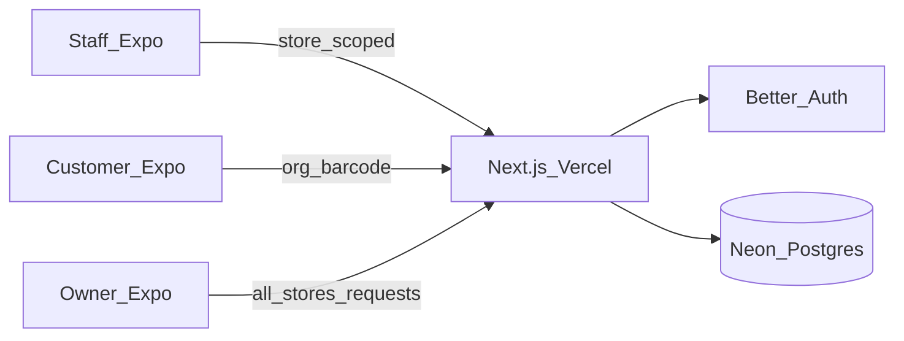

# Off-licence multi-store app (Expo + Vercel)

## Decisions locked in
- **Audience:** Staff + customers in one Expo app (role-based UI)
- **Stores:** Multi-store (one organisation owns many locations)
- **Customer v1:** Browse only — scan/search barcode, see which stores have stock and price
- **Staff:** Logged-in staff are **bound to one store** — they only see that store's stock
- **Staff actions:** Report **stock count** (stocktake) and **request new stock** (scan product → request qty)
- **Owner fulfilment:** No supplier/cash-and-carry integrations yet — owner sees all store requests, buys offline, then **marks done** with **quantity bought**
- **Grouping:** Requests and catalogue organised by **product category** + **source place** (where stock is sourced, e.g. Booker / Bestway / local cash & carry)
- **Stack:** Expo + Next.js API on Vercel + Neon Postgres + Better Auth
- **No payments / online orders** in MVP

## Architecture



**Repo layout (Turborepo):**
- [`apps/mobile`](apps/mobile) — Expo Router
- [`apps/api`](apps/api) — Next.js App Router API
- [`packages/db`](packages/db) — Drizzle schema + migrations
- [`packages/shared`](packages/shared) — Zod types / API contracts

## Data model

- **organisation** — the off-licence business
- **store** — location (`name`, address, opening hours)
- **user** + Better Auth tables
- **membership** — `userId`, `organisationId`, `role` (`owner` | `manager` | `staff` | `customer`), **`storeId` required for staff** (and optional for manager; null for owner = all stores)
- **product** — org catalogue: `barcode`, name, brand, **`category`** (e.g. beer, wine, spirits, soft_drinks, tobacco, snacks), **`sourcePlace`** (where to source: named cash & carry / wholesaler), size, ABV, image
- **inventory** — per store: `storeId`, `productId`, `quantity`, `sellPricePence`, `reorderLevel`
- **stock_count** — stocktake log: `storeId`, `productId`, `countedByUserId`, `quantityCounted`, `previousQuantity`, `createdAt`
- **stock_request** — restock request from staff:
  - `storeId`, `productId`, `requestedByUserId`
  - `quantityRequested`, `note` optional
  - `status`: `open` | `done` | `cancelled`
  - `fulfilledByUserId`, `quantityBought`, `fulfilledAt` (set when owner marks collected from cash & carry)
- *(Optional later)* **supplier** table — MVP uses `product.sourcePlace` string/enum so requests group cleanly without integrations

Barcode uniqueness: `(organisationId, barcode)`.

## Role rules (updated)

| Role | Stock visibility | Actions |
|------|------------------|---------|
| **staff** | **Only their assigned store** | Scan → view product; report stock count; create stock request |
| **manager** | Their store(s) | Same as staff + edit sell price / reorder level |
| **owner** | All stores in org | View all inventory; **request board**; mark requests done + enter qty bought (updates inventory); manage products (category + source place); invite users |
| **customer** | All stores (availability) | Barcode finder across stores only |

Staff APIs always filter `WHERE storeId = membership.storeId`. Never return other stores' quantities to staff.

## Core flows

```mermaid
sequenceDiagram
  participant Staff
  participant API
  participant Owner
  participant DB
  Staff->>API: Scan barcode at their store
  API->>DB: Product + inventory for that store only
  Staff->>API: Submit stock_count or stock_request
  API->>DB: Insert count / open request
  Owner->>API: List open requests grouped by sourcePlace then category
  Owner->>API: Mark done with quantityBought
  API->>DB: status=done; inventory.quantity += quantityBought
```

**Staff — stock count**
1. Login → locked to their store (no store picker unless manager with multiple)
2. Scan barcode → see product name, category, source place, current system qty
3. Enter counted qty → saves `stock_count` and sets `inventory.quantity` to counted value (or records variance; **default: overwrite quantity to counted**)

**Staff — request stock**
1. Scan (or pick from low-stock list) → enter qty needed + optional note
2. Creates `stock_request` with `status=open`
3. Staff can see **their store's** open/done requests only

**Owner — fulfil (cash & carry)**
1. **Requests** screen: group list by **`sourcePlace`**, then by **`category`** (shopping-list style for a cash-and-carry run)
2. Each line: store name, product, qty requested, who asked
3. After buying offline: mark **Done**, enter **quantity bought**
4. System sets request `done` and **increments that store's inventory** by `quantityBought` (no external PO/API)

**Customer**
1. Scan → product + stores with stock > 0 (price + address)
2. No requests / counts

## Auth & API (key routes)

- Better Auth on Next.js; Expo session via SecureStore
- `GET /api/products/by-barcode` — customer: all stores; staff: single store context
- `GET /api/stores/:storeId/inventory` — staff: only if `membership.storeId` matches
- `POST /api/stock-counts` — staff+ for own store
- `POST /api/stock-requests` — staff+ for own store
- `GET /api/stock-requests?status=open` — owner: all stores, response grouped by `sourcePlace` → `category`
- `POST /api/stock-requests/:id/fulfil` — owner: `{ quantityBought }` → mark done + bump inventory
- Product CRUD (owner): set `category` + `sourcePlace`

## Mobile UX (Expo)

**Staff tabs:** Scan | Inventory (my store) | Requests (my store) | More  
**Owner tabs:** Scan (org) | Requests (fulfil board) | Stores | Products | More  
**Customer tabs:** Scan | Stores  

Inventory / request lists: section headers by **category**; owner fulfil board primary sort by **source place**.

## Infra

- Neon Postgres via Vercel Marketplace
- Env: `DATABASE_URL`, `BETTER_AUTH_SECRET`, `EXPO_PUBLIC_API_URL`
- EAS Build later for TestFlight / Play

## Implementation order

1. Monorepo scaffold (Turborepo + Expo + Next.js + Drizzle + Better Auth)
2. Schema + migrations (membership.storeId, category, sourcePlace, stock_count, stock_request)
3. Auth + store-scoped authorisation helpers
4. Staff scan → count + request APIs/screens
5. Owner fulfil board (group by sourcePlace + category) + inventory bump
6. Customer multi-store barcode lookup
7. Seed (1 org, 2 stores, staff per store, sample products with categories/sources) + README

## Out of scope for MVP
- Cash-and-carry / wholesaler API integrations
- Online payment or collection orders
- Formal purchase orders / invoices
- Push notifications when owner fulfils
- Age verification / Challenge 25
- Public unauthenticated browse
